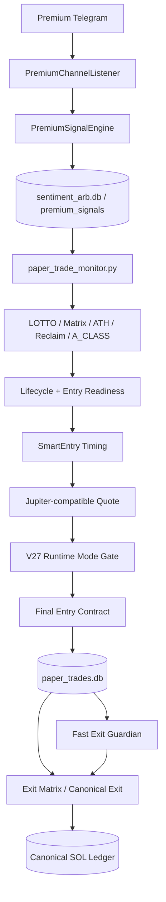
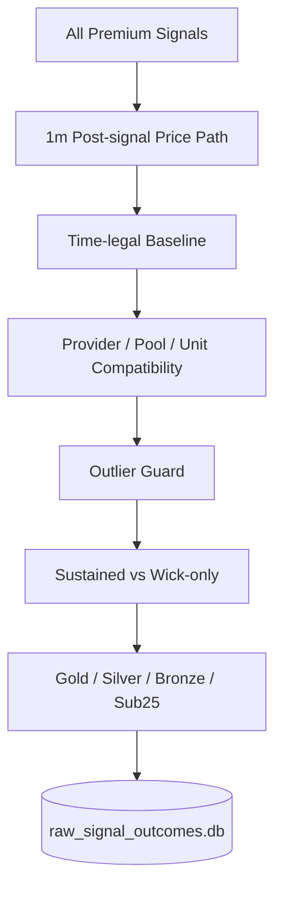
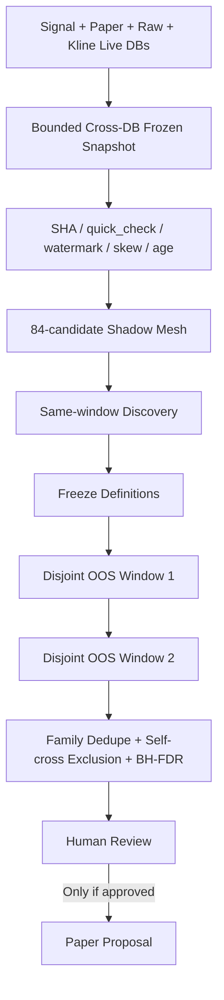

# Sentiment Arbitrage System｜恢复、闭环与演进总方案

Plan ID: `SAS-RECOVERY-MASTER-2026-08-08`

Status: `P0_C_SHARED_STAGE_BUDGET_IMPLEMENTED_LOCALLY_PENDING_PR_AND_PRODUCTION_ACCEPTED_SNAPSHOT_VALIDATION`

Baseline commit: `7b46dcd55c35231dc5157b68882c6cf89986d1c4`

Implementation worktree: `/Users/lobos/.devspace/worktrees/sentiment-arbitrage-system-04eed4ac`

Deployment status: `P0_A_B_C_THROUGH_P0_C_7_DEPLOYED__P0_C_8_NOT_DEPLOYED`

Production observation: `2026-08-09T07:54:04Z`（Sydney `2026-08-09 17:54:04 AEST`）

Default operating mode: `paper_only_measurement_first`

Promotion allowed: `false`

Production strategy change allowed: `false`

Automatic live enablement allowed: `false`

---

## 0｜文档定位与权威顺序

这份文档是当前项目从“复杂但不闭环”恢复到“可证明、可执行、可学习”的唯一实施基线。

它不取代以下不可变规则：

1. `AGENTS.md` 的策略、闸门、执行器、仓位、钱包和风险边界；
2. `docs/problem-solving-operating-principles.md` 的现实优先、测量优先、一次一个主要矛盾；
3. `docs/agents/gold-silver-capture-discovery-loop.md` 的同窗口发现不得推广规则；
4. 已冻结 OOS 定义、人工审批记录和永久账本。

在项目描述发生冲突时，权威顺序为：

```text
真实生产证据与 canonical ledger
        >
本文件记录的当前实施状态
        >
当前代码与配置
        >
专项契约文档
        >
旧 README / 旧版本架构文档
```

根目录 `README.md` 和部分 v7.x 文档描述的是更早的“Soft Score → Decision Matrix → GMGN Executor”体系，不能再作为当前运行事实来源。

---

## 1｜系统现在到底是什么

当前系统不是严格金融定义中的无风险套利系统，也不是简单的“情绪评分后自动买币”机器人。

它的准确定位是：

> **面向 Solana Meme 币的测量优先型凸性机会捕获与交易控制系统。**

系统要连续回答：

```text
市场中是否出现了真正持续上涨的候选？
        ↓
系统是否及时观察到？
        ↓
决策时刻是否存在真实可执行报价？
        ↓
策略是否会在当时进入？
        ↓
治理闸门是否允许进入 paper ledger？
        ↓
进入以后是否拿到 +50% / +100%？
        ↓
最终结果是否按 realized SOL 被可信记账？
```

项目目标来自 `config/strategy-goal.yaml`：

- rolling 24h realized win rate：`0.60`；
- gold/silver capture rate：`0.60`；
- winner clean-quote recall：`0.60`；
- strategy bucket ROI：`2.00`；
- 单笔最大亏损：`20%`；
- shadow first；
- 一次只改一个变量；
- 只在正 EV 后考虑推广；
- 推广必须保留人工审批边界。

这些是目标，不是当前已实现的结果。

---

## 2｜核心口径

### 2.1 Gold / Silver

严格 raw outcome 定义：

- Gold：信号后两小时内，持续峰值至少 `+100%`；
- Silver：信号后两小时内，持续峰值至少 `+50%`；
- Bronze：至少 `+25%`；
- 不把单根异常插针直接当成持续金狗／银狗。

### 2.2 严格 raw denominator

只有同时满足以下条件才进入严格 raw denominator：

- 信号已经成熟满两小时；
- 基准价格在允许时间内出现；
- 基准与后续路径的 provider、pool、source kind 和 price unit 兼容；
- 没有异常价格或跨源混用；
- sustained outcome 可评估；
- 严格主口径使用 high／medium baseline confidence。

### 2.3 Operational missed denominator

Dashboard 的 `paper_missed_signal_attribution` 口径是运营归因集合，用于统计不同 gate/reason 后续出现的机会。

它不是严格 raw denominator，不能与严格 sustained raw dogs 直接当作同一个总体。

所有报告必须明确命名：

```text
strict_raw_sustained_denominator
operational_clean_missed_denominator
paper_fills_denominator
closed_realized_denominator
```

禁止用一个模糊的“eligible dogs”字段混合四者。

### 2.4 PnL 与价格真相

- Jupiter-compatible quote：entry/exit 可执行价格真相；
- DexScreener／GMGN／GeckoTerminal：market context，不是最终 cost basis；
- realized SOL：正式账本和风险契约真相；
- mark peak：研究与路径上下文，不能代替 realized accounting。

---

## 3｜当前三条系统主链

### 3.1 生产候选与 paper 执行链



权责：

- Node：接收、解析和写入 premium signal；
- Python `paper_trade_monitor.py`：当前 paper 生命周期 owner；
- `execution_bridge.js`：报价／模拟成交桥；
- runtime mode gate：治理允许范围；
- final entry contract：最后硬风险边界；
- canonical ledger：正式 SOL 事实源。

### 3.2 严格市场结果测量链



这条链不下单，只回答市场事实。

### 3.3 冻结研究与 AutoLoop 链



AutoLoop 只能读取冻结 evaluator snapshot；不得直接读取正在变化的四个 active DB 后形成推广结论。

---

## 4｜关键数据存储与边界

| 存储 | 当前职责 | 应有边界 |
|---|---|---|
| `sentiment_arb.db` | premium signals、Node 信号证据 | 信号事实与解析证据 |
| `paper_trades.db` | paper trades、decision events、missed attribution、A_CLASS、shadow mesh 等 | 当前过度集中；后续拆分 |
| `raw_signal_outcomes.db` | 严格 raw outcome、raw bars、observations | 市场结果测量，不受 paper DB 重置影响 |
| `kline_cache.db` | Kline 与路径补充 | 市场路径缓存，不作为 canonical ledger |
| `v27_event_log` | append-only 契约事件 | read model 唯一派生输入 |
| `v27_read_models` | denominator、mode readiness、freshness | 只读 materialized governance truth |
| `agent_evidence/current` | 四库冻结 evaluator snapshot | AutoLoop 唯一评估输入 |
| `canonical_trade_ledger` | realized SOL 账本 | 永久保护，不自动清理 |

---

## 5｜2026-08-08 生产事实快照

以下是一次性观测，不应在未来被当成永久当前值。

Observation UTC: `2026-08-08T04:02:30Z`

Observation Sydney: `2026-08-08 14:02:30 AEST`

Deployed commit: `f592c47a137871c4dd70911a4c6d783297c15395`

### 5.1 Runtime

| 指标 | 观测值 |
|---|---:|
| service status | `ok` |
| uptime | `365,441s` |
| paper DB integrity | `ok` |
| paper DB size | `25,494.22 MB` |
| review snapshot | fresh，约 `4.4m` |
| Telegram ingestion | `live_stream_healthy` |
| latest signal age | 约 `5m` |
| premium signal rows | `64,351` |
| raw-path worker | running，但累计 timeout `155` |
| AutoLoop scheduler | running，但最近一次被 evaluator snapshot 阻止 |

### 5.2 Strict raw discovery

| 指标 | 观测值 |
|---|---:|
| 24h signals | `760` |
| matured | `703` |
| strict eligible unique | `185` |
| strict raw Kline coverage | `41.82%` |
| sustained Gold unique | `35` |
| sustained Silver unique | `20` |
| sustained Gold/Silver unique | `51` |
| wick Gold/Silver unique | `185` |
| wick-only Gold/Silver unique | `154` |

### 5.3 Decision funnel on attributable raw dogs

```text
50 strict sustained raw dogs in attributable funnel
        ↓
48 have decision records
        ↓
48 quote-clean
        ↓
15 would-enter
        ↓
0 entered
        ↓
0 held-to-silver-or-gold
```

当前第一执行矛盾不是 Telegram，不是完全缺少 quote，也不是“策略一个候选都没有选中”。

当前最直接的执行断点是：

```text
would-enter → runtime governance → paper entry
```

### 5.4 KPI proof

- `verified=false`；
- `status=kpi_evidence_incomplete`；
- `mode_readiness` missing；
- denominator read-model health missing；
- fills `0`；
- closed `0`。

运营 missed denominator 显示 `294` 个 clean missed candidates；它不能与严格 sustained Gold/Silver unique `51` 直接比较。

---

## 6｜主要矛盾排序

采用 Dependency / Evidence / Reversibility / Blast Radius 各 0–3 评分。

| 优先级 | 矛盾 | 分类 | 依赖 | 证据 | 可逆 | 风险 | 总分 |
|---|---|---|---:|---:|---:|---:|---:|
| P0-A | V27 read-model worker 在生产默认路径不可达 | INSTRUMENTATION / GOVERNANCE | 3 | 3 | 3 | 3 | 12 |
| P0-B | evaluator frozen snapshot 未成功生成，AutoLoop fail-closed | INSTRUMENTATION | 3 | 3 | 2 | 3 | 11 |
| P0-C | `.env` 与 session 状态被 Git 跟踪 | SECURITY | 3 | 3 | 2 | 3 | 11 |
| P1-A | strict raw coverage 约 42%，raw-path worker 多次 timeout | EPISTEMIC + 部分 CAUSAL | 2 | 3 | 2 | 2 | 9 |
| P1-B | 25.5GB paper DB 混合运营与研究职责 | STORAGE | 3 | 3 | 1 | 2 | 9 |
| P2 | 巨型 monitor/dashboard 与 registry 漂移 | MAINTAINABILITY | 2 | 3 | 1 | 2 | 8 |
| P3 | 新策略、X narrative、cohort features | RESEARCH | 1 | 1 | 2 | 1 | 5 |

当前锁定的唯一主要矛盾：`P0-A`。

在 P0-A 验收前，不调整策略、gate、exit、AI、仓位或风险。

---

## 7｜P0-A 根因：V27 read-model worker 不可达

生产 supervisor 当前明确设置：

```text
V27_READ_MODEL_REFRESH_WORKER_ENABLED=true
SOURCE_SHADOW_WORKERS_ENABLED=false
PAPER_DB_WRITE_SIDECARS_ENABLED=false
```

`SOURCE_SHADOW_WORKERS_ENABLED=false` 的原因是防止 Node 与外层 supervisor 重复启动 paper DB sidecars，这个目标正确。

但 `src/index.js::startShadowDataSidecars()` 当前顺序为：

```text
start paper review snapshot worker
        ↓
if SOURCE_SHADOW_WORKERS_ENABLED=false
        ↓
return alwaysOnWorkers
        ↓
永远到不了 v27-read-model-refresh worker 定义
```

后果：

```text
mode_readiness.json missing
        +
denominator_freshness.json missing
        ↓
runtime mode gate fail-closed
        ↓
would-enter cannot become paper entry
```

`v27_read_model_refresh.py` 本身：

- 只读取 append-only `v27_event_log`；
- 原子写入 JSON read models；
- 不需要写 `paper_trades.db`；
- 不应受 paper DB integrity marker 阻止；
- 适合作为独立 always-on governance worker。

---

## 8｜目标闭环

### 8.1 Execution Evidence Loop

```text
Premium signal
→ decision record
→ quote-clean
→ would-enter
→ runtime mode gate
→ final entry contract
→ paper entry intent
→ paper trade committed
→ canonical ledger entry
→ canonical exit
→ realized SOL result
→ attribution update
```

每一箭头必须有：

- event/table owner；
- timestamp；
- lifecycle/opportunity key；
- final reason；
- observable counter；
- fail-closed behavior；
- replay-safe idempotency。

### 8.2 Research Evidence Loop

```text
active databases
→ immutable bounded evaluator snapshot
→ validated manifest
→ same-window discovery
→ frozen hypothesis family
→ two disjoint OOS windows
→ multiplicity control
→ downstream lift
→ human review
→ paper-only proposal
```

同窗口命中只能生成 hypothesis，不能生成生产配置。

---

## 9｜实施包总览

### P0-SEC｜凭据与仓库安全

目标：把已跟踪 secret/session 状态按潜在泄露处理。

只允许人工／运维执行：

1. 轮换 `.env` 中曾出现的全部 token/key；
2. 注销 Debot／GMGN 等 session；
3. 删除当前 tracking；
4. 清理 Git history；
5. 增加 secret scanner 和 pre-commit；
6. 生产只从部署平台 secret manager 注入。

自动 Agent 不得替用户轮换真实凭据，也不得打印 secret 值。

验收：

- `git ls-files` 不再包含 `.env` 与 session state；
- secret scanner 对完整历史无高置信未处置 secret；
- 旧 session 失效；
- 新凭据仅存在于 secret manager。

### P0-A｜恢复 V27 Read Model 与可观测性

实施状态：`LOCAL_IMPLEMENTATION_COMPLETE / PRODUCTION_VALIDATION_PENDING`

目标：

- worker 在 `SOURCE_SHADOW_WORKERS_ENABLED=false` 时仍能启动；
- worker 不依赖 paper DB marker；
- standalone dashboard 可跨进程观察 worker PID、状态、最后成功时间和 artifact freshness；
- `/health` 明确显示缺失、starting、stale、invalid、not-running 与 healthy；
- 不自动放开任何 runtime mode。

设计：

1. 抽出 `startV27ReadModelRefreshWorker()`；
2. 在 `alwaysOnWorkers` 中、所有 source-shadow early-return 之前启动；
3. `markerGuard=false`；
4. worker 写 `v27_read_model_worker_status.json`；
5. Dashboard 同时读取：
   - status artifact；
   - lock PID；
   - denominator freshness；
   - mode readiness；
   - artifact mtime；
6. `/health.v27_read_model_worker` 对外提供 public-safe 聚合状态；
7. health 只因 worker 未运行／artifact 缺失或过期而 degraded；
8. readiness 仍可为 blocked，这不等于 worker failure。

明确不做：

- 不把 `normal_tiny_ready` 强制改为 true；
- 不关闭 runtime mode gate；
- 不绕过 contract blockers；
- 不开启 live execution；
- 不改变 candidate、entry、exit、risk。

验收：

- 静态 reachability 测试证明 worker call 在 early-return 之前；
- `SOURCE_SHADOW_WORKERS_ENABLED=false` 配置仍保留；
- worker status 测试覆盖 success/error/stale PID；
- dashboard health 测试覆盖 healthy/starting/stale/not-running；
- `mode_readiness.json` 与 `denominator_freshness.json` 首次生成；
- 连续至少 10 个 refresh interval 更新 mtime；
- runtime mode gate 仍依据真实 matrix fail-closed。

回滚：

- 设置 `V27_READ_MODEL_REFRESH_WORKER_ENABLED=false`；
- 或回滚该单独提交；
- mode gate 在 artifact 缺失时继续 fail-closed。

### P0-B｜使 Mode Readiness 契约收敛，而不是绕过

目标：区分真实安全缺口、registry 漂移和静态扫描假阳性。

已知类型：

- helper 内统一鉴权被静态扫描误判为路由未鉴权；
- alias routes 被逐行 parser 错误识别；
- SQLite `db.exec` 被误判为 shell exec；
- route count、feature flags、error taxonomy、job registry 和 hash 锚定旧代码；
- 新 raw outcome / raw bars / runtime log 写路径未登记。

实施规则：

1. 先修 verifier 语义，不为了变绿重复添加鉴权；
2. 为真实新增写路径补 registry；
3. 更新 source anchors 与 hashes；
4. 每个 contract 的失败必须可解释；
5. 不允许通过删除 contract 或强制 `pass` 收敛。

验收：

- `test_v27_mode_readiness.py` 全绿；
- basic readiness 无无法解释 blocker；
- 真实安全缺口有修复或显式人工 waiver；
- `highest_allowed_mode` 由证据计算产生。

### P0-C｜恢复 Frozen Evaluator Snapshot 与 AutoLoop

目标：让 AutoLoop 只读取被接受的四库冻结快照。

当前：

- scheduler 活跃；
- 最近一次 `blocked_evaluator_snapshot_required`；
- PR #70 的 indexed-time 方案已证明能把历史 read lock 从约 300s 降到约 3.33s，但仍需独立复核和正式合并／部署。

实施：

1. 独立复核 PR #70；
2. 证明 production query plan 使用 `observed_at` index；
3. 检查 output cap、free-space reserve、time skew、quick-check、watermarks；
4. 生成 accepted manifest；
5. `/health` 增加 evaluator worker status 与最后 reject reason；
6. 恢复 AutoLoop，但仍 `promotion_allowed=false`。

验收：

- 四库 snapshot `accepted=true`；
- manifest SHA 与 DB quick-check 通过；
- source read lock 在预算内；
- AutoLoop 使用 snapshot path，而非 active DB；
- full run 成功生成 fresh primary capture；
- OOS lineage 不被同窗口 run 改写。

### P0-D｜Paper End-to-End 受控验收

前置：P0-A、P0-B 均通过。

目标：证明完整链路可以真实写成 paper evidence。

验收链：

```text
one controlled paper-only candidate
→ would-enter
→ runtime mode allowed by real matrix
→ final contract pass
→ quote simulation
→ paper_trade_entry_intent
→ paper_trade_entry_committed
→ canonical ledger entry
→ controlled exit
→ realized SOL accounting
```

限制：

- paper only；
- 不增加仓位；
- 不改变 gate；
- 不使用 synthetic route 冒充 executable quote；
- 不人工插入虚假 trade row。

### P1-A｜恢复严格测量覆盖

目标：提高 strict raw path coverage，并减少 observer timeout。

实施：

- 区分 strict baseline coverage 与 research-grade path coverage；
- 解决 raw-path timeout／锁竞争；
- 继续 indexed-first；
- 只有持续扩大时才引入更重 on-chain reconstruction；
- 避免为了提高百分比放松严格 denominator 定义。

验收：

- strict coverage 的改善来自更多合法 path，而不是降标准；
- raw-path observer 连续 10 次无 timeout；
- no-path、late-baseline、cross-source、outlier 分桶可解释；
- raw DB 与 Kline DB 继续通过 integrity check。

### P1-B｜控制 Paper DB 增长与职责分离

目标：减少 25GB+ hot DB 对执行、快照和审计的影响。

实施顺序：

1. 列出 table/index size；
2. 验证 retention status；
3. 只对已归档、已 hash 验证的高频研究数据清理；
4. 必要时受控 VACUUM INTO，而不是在线原地 VACUUM；
5. 分离：
   - operational paper ledger；
   - decision audit；
   - candidate shadow observations；
   - research snapshots；
6. 永久保护 ledger、fills、exits、approvals、freeze registry。

### P2｜运行架构拆分

目标：降低巨型文件和多权威冲突。

目标模块：

```text
signal_ingestion
candidate_router
entry_arbiter
execution_simulator
mode_and_risk_arbiter
paper_ledger
exit_arbiter
outcome_attribution
materialized_read_models
```

退出权责：

```text
Guardian = 快速触发与紧急证据
ExitMatrix = canonical exit reason 与 accounting owner
```

拆分前必须先写 characterization tests，不做大爆炸重写。

### P3｜重新启动策略研究

只有执行闭环和研究闭环都恢复后才进行：

- 84-candidate frozen OOS；
- X narrative shadow context；
- cohort / market simultaneity dimensions；
- pump.fun comparable source trial；
- entry-mode downstream lift；
- exit policy shadow simulation。

推广最低路径：

```text
same-window discovery
→ freeze
→ disjoint OOS 1
→ disjoint OOS 2
→ family dedupe
→ self-cross exclusion
→ BH-FDR
→ downstream lift
→ human review
```

---

## 10｜P0-A 代码变更范围

允许修改：

- `src/index.js`；
- `scripts/v27_read_model_refresh.py`；
- `src/web/dashboard-server.js`；
- 对应 Node/Python tests；
- 本文实施 ledger。

禁止修改：

- `scripts/paper_trade_monitor.py` 的策略与 gate；
- `entry_engine.py`；
- `exit_engine.py`；
- `final_entry_contract.py`；
- A_CLASS size/risk config；
- wallet/executor；
- candidate catalog；
- OOS frozen definitions。

Diff 预期：

- 单一 worker reachability 修复；
- status artifact；
- public-safe health；
- tests；
- 无交易决策行为变化。

---

## 11｜P0-A Worker Status Contract

文件：

```text
/app/data/v27_read_models/v27_read_model_worker_status.json
```

Schema：`v2.7.0.read_model_worker_status.v1`

最低字段：

```json
{
  "schema_version": "v2.7.0.read_model_worker_status.v1",
  "running": true,
  "pid": 123,
  "started_at": "...",
  "last_attempt_at": "...",
  "last_success_at": "...",
  "last_error_at": null,
  "error_count": 0,
  "status": "ok",
  "dashboard_safe": false,
  "highest_allowed_mode": "observe_only",
  "normal_tiny_ready": false,
  "artifact_paths": {
    "denominator_freshness": "...",
    "mode_readiness": "..."
  }
}
```

Status 语义：

- `starting`：PID alive，首次 refresh 尚未完成；
- `ok`：worker alive，artifacts fresh 且可解析；
- `readiness_blocked`：worker 健康，但 matrix 仍阻止目标 mode；
- `refresh_error`：最近一次 refresh 异常；
- `worker_not_running`：配置启用但 PID 不存在／已退出；
- `artifact_missing`：worker 超过启动窗口仍无 artifact；
- `artifact_stale`：artifact 超过 freshness budget；
- `artifact_invalid`：JSON 无法解析或 schema 不合法；
- `disabled`：显式关闭。

`readiness_blocked` 不是 worker crash，也不得自动触发绕过。

---

## 12｜Dashboard Health Contract

`/health.v27_read_model_worker` 只公开聚合、无 secret 数据：

```text
configured / enabled
running / pid_alive
status
started_at / last_attempt / last_success / last_error
artifact freshness
health/readiness file paths
highest_allowed_mode
observe/shadow/ultra/normal readiness booleans
blocking contract counts
```

Root health degraded 条件仅包括：

- worker 应启用但不运行；
- 超过 startup grace 仍无 artifact；
- artifact stale；
- artifact parse invalid。

以下情况不作为 worker failure：

- `normal_tiny_ready=false`；
- contract matrix 合法地阻止 mode；
- KPI targets 未达到。

---

## 13｜测试矩阵

### Node

- worker helper 存在；
- always-on call 位于 `SOURCE_SHADOW_WORKERS_ENABLED` early-return 之前；
- `markerGuard=false`；
- source shadow disabled 时仍保留 read-model worker；
- health reader：
  - disabled；
  - starting；
  - healthy/fresh；
  - stale artifact；
  - stale PID；
  - invalid JSON；
- `/health` 包含 public-safe worker field。

### Python

- atomic status write；
- success 更新 `last_success_at`；
- failure 增加 `error_count` 并保留前一次成功；
- stop 更新 `running=false`；
- duplicate lock 不覆盖主 worker status；
- 原有 denominator、snapshot、mode readiness tests 不回归。

### Safety regression

- paper-mode secret quarantine 继续通过；
- runtime mode gate missing artifact 仍 fail-closed；
- final entry contract 无 diff；
- strategy config 无 diff；
- candidate count 仍为 84；
- `promotion_allowed=false`。

---

## 14｜部署与验证 Runbook

### 14.1 Pre-deploy

1. 确认 diff 仅在 P0-A 允许范围；
2. 运行定向 tests；
3. 运行相关完整 tests；
4. 独立 verifier 检查：
   - worker reachability；
   - no trading behavior change；
   - status schema；
   - health privacy；
   - rollback flag。

### 14.2 Deploy

部署一个 commit，不与 PR #70 或其他策略／存储变更捆绑。

### 14.3 0–5 分钟

检查：

- `/health.commit` 为新 commit；
- `v27_read_model_worker.running=true`；
- PID alive；
- status 从 `starting` 进入 `ok` 或 `readiness_blocked`；
- 没有 duplicate worker；
- paper DB integrity 仍 `ok`。

### 14.4 5–15 分钟

检查：

- `denominator_freshness.json` 存在并更新；
- `mode_readiness.json` 存在并更新；
- mtime 连续推进；
- error_count 不增长；
- runtime mode gate 不再因为 `v27_mode_readiness_missing` 阻止；
- 若仍阻止，reason 必须变为真实 contract blocker。

### 14.5 2 小时

检查：

- 至少 10 次 refresh；
- 无 stale；
- 无 worker restart storm；
- would-enter 的 final reason 可归因；
- 没有未经证据的 paper mode 扩大。

### 14.6 24 小时

检查：

- 读模型 freshness 稳定；
- readiness blocker 分布稳定、可解释；
- paper entry 是否开始出现必须由真实 mode matrix 决定；
- 若 0 entry，定位下一层 blocker，不调策略。

### 14.7 Rollback

1. 设置 `V27_READ_MODEL_REFRESH_WORKER_ENABLED=false`；
2. 回滚单一 P0-A commit；
3. 确认 runtime gate 因 artifact missing fail-closed；
4. 不删除最后一份 read-model artifact，保留 incident evidence。

---

## 15｜失败处理原则

- Worker 启动但 refresh exception：记录 status，不覆盖上一次成功；
- Artifact stale：Dashboard 标记 degraded，runtime gate按现有 freshness contract处理；
- Event log invalid：read model fail-closed，不自动重写历史；
- Contract blockers 增加：先分类为真实缺口、registry drift 或 verifier false positive；
- 任何“让系统重新下单”的修改必须单独审批，不能伪装成 observability fix。

---

## 16｜本地仓库与分支治理

原始本地 checkout：

- 落后远端；
- 有大量未提交研究修改；
- 包含 local-only X narrative、cohort 草案与其他实验。

实施规则：

1. 不在原始脏 `main` 上直接 pull/reset；
2. 所有正式实现从 fresh `origin/main` 创建独立 worktree；
3. local-only 实验先做 inventory，再决定 cherry-pick；
4. 每个 work package 一个分支／提交序列；
5. 不把 P0-A 与 PR #70、secret cleanup 或策略实验混合。

---

## 17｜完成定义

项目恢复完成，不等于“服务 HTTP 200”，也不等于“出现一笔盈利”。

恢复完成必须同时满足：

### Execution loop

- fresh signals；
- executable quotes；
- would-enter 到 runtime gate 有真实 reason；
- mode readiness materialized 且 fresh；
- final entry contract 生效；
- paper intent/commit/ledger/exit/realized accounting 闭合。

### Research loop

- accepted frozen evaluator snapshot；
- AutoLoop 不读 active DB；
- fresh primary capture；
- OOS clocks 与 freeze lineage 可审计；
- FDR 与 negative controls 生效；
- promotion 始终人工审批。

### Safety

- 无 tracked secrets/session；
- live private keys 不进入 paper runtime；
- permanent ledger 不被 retention 删除；
- rollback 与 incident evidence 可用。

---

## 18｜实施 Ledger

### 2026-08-08｜文档基线

- 基于 production commit `f592c47`；
- 生产观测：would-enter `15`，entered `0`；
- `mode_readiness` 与 denominator health missing；
- AutoLoop 最近一次 `blocked_evaluator_snapshot_required`；
- paper DB 约 `25.5GB`；
- strict raw Kline coverage 约 `41.82%`；
- 当前主要矛盾锁定为 P0-A；
- 本文完成时尚未修改代码；
- `promotion_allowed=false`；
- strategy/gates/executor/canary/wallet/risk 均未改变。

### 2026-08-08｜P0-A 本地实现完成

实施基线与隔离：

- 从 fresh `origin/main`／production SHA `f592c47` 创建独立 DevSpace worktree；
- 未对原始 `~/sentiment-arbitrage-system` 脏工作区执行 pull、reset、覆盖或清理；
- 本次没有 commit、push 或 production deploy；
- `promotion_allowed=false`，automatic live enablement 仍为 false。

代码变更：

1. `src/index.js`
   - 新增独立 `startV27ReadModelRefreshWorker()`；
   - 把 worker 纳入 `alwaysOnWorkers`，位置在 `SOURCE_SHADOW_WORKERS_ENABLED` 与 `PAPER_DB_WRITE_SIDECARS_ENABLED` 提前返回之前；
   - 设置 `markerGuard=false`，因为 worker 读取 event log、原子写 JSON read model，不依赖 paper DB；
   - 保留本机默认 `./data`，生产由 `/app/data` 环境变量覆盖。
2. `scripts/run_zeabur_services.sh`
   - 全局导出 `V27_READ_MODEL_REFRESH_WORKER_ENABLED`；
   - 全局导出 `V27_READ_MODEL_WORKER_STATUS_PATH`，使 standalone dashboard 与 Node worker 看到同一配置。
3. `scripts/v27_read_model_refresh.py`
   - 新增 `v2.7.0.read_model_worker_status.v1` 原子状态文件；
   - 记录 PID、启动／停止、最后尝试／成功／错误、错误计数、artifact 路径、readiness 状态；
   - 区分 `starting`、`refreshing`、`ok`、`readiness_blocked`、`refresh_error`、`stopped`；
   - one-shot 与 continuous worker 共用同一个 flock；锁被占用时 fail-closed 并返回专用 reason；
   - 修复旧锁原语：重复 contender 不再因以 `w` 打开 lock file 而截断 active owner PID。
4. `src/web/dashboard-server.js`
   - 新增 public-safe `readV27ReadModelWorkerHealth()`；
   - `/health` 增加 `v27_read_model_worker`；
   - protected read-model health 增加 worker 状态；
   - 区分 `disabled`、`starting`、`ok`、`readiness_blocked`、`worker_not_running`、`refresh_error`、`artifact_missing`、`artifact_stale`、`artifact_invalid`；
   - `readiness_blocked` 表示 worker 健康而治理仍阻止 mode，不触发绕过；
   - denominator 与 mode-readiness artifact 增加 schema fail-closed 校验；
   - continuous worker 活跃时，手动 refresh 立即返回 `continuous_worker_running`；Python 侧仍以共享锁作为最终权威。
5. Tests
   - 补充 worker 可达性、状态生命周期、锁文件 PID 保留、one-shot 竞态、schema mismatch、startup grace、stale／invalid／refresh-error 和 governance-blocked 健康语义测试；
   - refresh test 只验证 matrix 被忠实物化；“哪些 mode 应放行”的政策断言继续由 `test_v27_mode_readiness.py` 负责，未被削弱。

独立反方审查：

- 第一轮 Codex review 给出 `REJECT/P2`：旧 `open("w")` 会在 flock 失败前截断 active worker PID，可能使手动入口误判；
- 已修复锁原语，并增加“duplicate contender 不改变 owner PID”的回归测试；
- 第二轮 Codex review 未再提出代码阻断项，确认共享锁、fail-closed health 与治理 blocker 均被保留；
- 第二轮之后增加了 artifact schema fail-closed 校验和对应边界测试；第三次最终 Codex review 因工具使用额度耗尽被中断，因此没有把未完成审查误报为最终批准；
- Claude Code 独立审查不可用，原因是本机未登录，因此同样没有把该工具缺失误报为通过。

最终验证：

- 静态检查：`git diff --check`、Node syntax、Bash syntax、Python compile 全通过；
- Python focused matrix：`22 passed`；
- Node 20 focused matrix：`77 passed`；
- 生产镜像使用 Node 20；本机默认 Node 22 与 `better-sqlite3` ABI 不兼容，因此正式 Node 验证固定使用 `npx -y node@20`；
- 完整 mode-readiness 相关套件：`53 passed, 2 failed`；这两项在本次改动前已存在，且仍保持 fail-closed：
  1. `AccessControlContract` 的 helper／alias 静态扫描仍返回 `missing_evidence`；
  2. 因治理 blocker 未收敛，`ultra_tiny` 仍为 `blocked`，没有被 P0-A 自动放行。

本次明确未改：

- strategy、candidate catalog、entry policy；
- hard gate、exit gate、SmartEntry、final entry contract；
- A_CLASS mode／size／budget；
- live executor、wallet、secret、canary、position size、risk limits；
- frozen OOS definitions、promotion policy。

下一锁定包：`P0-B｜使 Mode Readiness 契约收敛，而不是绕过`。P0-B 必须作为独立 diff 与独立部署单元执行，不能与 P0-A 或 PR #70 混合。

### 2026-08-08｜P0-B 本地实现完成

专项文档：`docs/agents/P0_B_MODE_READINESS_CONVERGENCE.md`。

结果：

- P0-A 基线上的 15 个 basic-readiness blocker 已收敛为 0；
- 136 个基础契约全部通过，`health.status=basic_contract_readiness_ok`；
- `observe_only_foundation_ready=true`；
- `normal_tiny_ready=false`，说明基础契约收敛没有自动提升运行模式；
- seeded ultra-tiny 正例、缺事件／缺 read model／错误 schema 反例均通过测试；
- AccessControl 能识别多行 route alias、fail-closed helper 与受保护外层分支，同时不会掩盖同 endpoint 的独立未鉴权入口；
- Dashboard 入口清单收敛为 103 个唯一逻辑路由，其中 public 5、protected 98；
- WritePath registry 与扫描均为 14；SQLite 写入中 7 个属于 authenticated break-glass，3 个属于严格限定的 internal observability；
- StaticPolicy 不再把 SQLite `Database.exec` 当作 shell，但真正的 shell `exec` 仍 fail；
- 并发、single-writer、background job、entry point、thread pool 和 service probe 锚点均与当前实现一致；
- feature flags 40/40、error taxonomy 250/250；
- V27 read-model worker 已进入 background-job registry、entry-point inventory 和 service-readiness probes；
- runtime config hash 与 59-file spec-change impact hash 已重算并可复现；
- Python basic contract：108 passed；
- Mode/read-model/runtime-gate：53 passed；
- 宽安全回归：210 passed；
- Node 20 / ABI 115 聚焦回归：77 passed；
- 静态、JSON、strict readiness 与 `git diff --check` 全通过；
- strategy、gates、Final Entry Contract、A_CLASS 参数、canary、wallet、executor、risk 和 promotion policy 均未改变；
- P0-B 独立 Codex 最终反方审查已尝试，但因本机 Codex 使用额度耗尽而未生成结论；Claude Code 也因未登录不可用，因此当前不宣称获得独立最终批准；
- 未 commit、未 push、未部署；线上仍运行 `f592c47`。

下一锁定包：`P0-C｜恢复 accepted frozen evaluator snapshot → AutoLoop`。在部署 P0-A/P0-B 并完成运行时验收以前，不启动 P0-C 的生产恢复操作。

### 2026-08-08｜P0-C 本地实现完成，等待生产 accepted snapshot 验收

专项文档：`docs/agents/P0_C_FROZEN_EVALUATOR_SNAPSHOT_AUTOLOOP_RECOVERY.md`。

结果：

- 复核并整合 PR #70／A3 v2.3 的 `observed_at` index-aware selection；
- 两张高频 candidate table 的时间 predicate 不再包裹索引列，必须使用 validated non-partial numeric `observed_at` index；
- producer 在复制前执行真实 `EXPLAIN QUERY PLAN`，manifest 记录 index columns、query plan、range-search 与 full-scan evidence；
- 缺 index、错误 column order、partial/index evidence 篡改、query-plan 篡改或 full scan 均 fail-closed；
- accepted producer status 记录 snapshot-specific manifest path 和 manifest SHA-256；
- authoritative consumer 新增 producer acceptance status、snapshot id、snapshot-specific manifest path、producer manifest SHA、disk preflight、output cap、source read-lock、skew、watermark、quick-check、DB SHA、selection 和 manifest SHA 重验；
- Dashboard preflight 只接受带 snapshot id、timestamp、snapshot-specific manifest path 与 64 位 SHA 的 Python contract 结果；
- Dashboard 把 snapshot-specific DB paths 传给 child，child 在 shared lease 内重验，避免 `current` alias 切换造成跨代混用；
- AutoLoop discovery、stage runner 与 OOS refresh status 均物化 `evaluator_snapshot_provenance.v1`；
- required provenance 缺失或被拒时，AutoLoop 以 `evaluator_snapshot_provenance_missing_or_rejected` fail-closed；
- `/health.evaluator_snapshot_worker` 区分 `disabled/starting/producer_accepted/failed/stale/contract_blocked/worker_not_running`；
- `producer_accepted` 不冒充 authoritative consumer acceptance；`consumer_ready` 仅在最近 Python preflight 对同一 snapshot/manifest/producer SHA 完整通过时成立；
- health 检查 snapshot 文件存在、大小与 future timestamp，但大文件 SHA/quick-check 只由 authoritative consumer 执行；
- producer degraded 与 consumer readiness 分离：上一份 accepted bundle 在契约、时效和最近 authoritative preflight 均有效时仍可安全消费；
- production shell 成为单一 producer owner，并监督自动重启；production Node child 显式禁用重复 producer；
- evaluator worker 已登记到 Background Job Registry、Entry Point Inventory、Runtime Worker Health Policy 与 Service Readiness Probes；
- v27-readiness CI 已纳入 Node 20、`npm ci`、producer、consumer、AutoLoop provenance、JSON、syntax、Python contract 和 Node behavior tests；
- `CICDMergeGateContract`、`SpecChangeImpactAnalysisContract` 与 Basic Readiness 重新计算通过；
- Basic Readiness：136/136 pass，`blocking_contracts=[]`；
- 最终 Python 宽回归：255 passed；最终 Node 20 / ABI 115 宽回归：79 passed；
- static、syntax、JSON、generated client、spec validate、strict readiness、mode-gate scope 与 `git diff --check` 全通过；
- 未修改 strategy、candidate、entry、exit、risk、wallet、live executor、OOS/FDR 或 promotion policy；
- 未 commit、未 push、未部署；生产仍未生成本版本 accepted snapshot；
- 因此当前只宣称“P0-C 本地实现完成”，不宣称线上 AutoLoop 已恢复。
- 独立 Codex verifier 第一轮曾因 producer SHA 未锚定、health 误报 authoritative acceptance、CI 未跑 Node behavior tests 给出 `REJECT`；三项修复后，第二轮窄范围独立 verifier 给出 `APPROVE`，未发现 active-DB fallback、promotion/mode/paper enablement 绕过或新的代码阻断项；
- reviewer 的只读 sandbox 无法创建 Python temp，且默认 Node 22 与 ABI 115 不一致；本地正式矩阵已在可写工作区与 Node 20 下完成 255/255、79/79，生产部署前仍需人工与真实数据复核。

### 2026-08-08｜P0-A/P0-B/P0-C 原子受控发布单元

发布清单：`docs/agents/P0_ABC_CONTROLLED_RELEASE_UNIT_20260808.md`。

- 发布基线固定为 `f592c47a137871c4dd70911a4c6d783297c15395`；
- 发布分支固定为 `release/p0-abc-recovery-20260808`；
- P0-A、P0-B、P0-C 保持可归因的子包，但采用一个原子 release SHA，避免治理哈希、入口注册和 worker 拓扑在人工拆分的中间树中失配；
- 部署和回滚均以同一个 release SHA 为单位；
- P0-D paper E2E 明确保持 `LOCKED`，不因部署 RUNNING、HTTP 200、Basic Readiness 绿色或 producer-only acceptance 自动解锁。

下一运行时验收：部署受控 P0-A/P0-B/P0-C 原子发布单元后，证明 production 首个 accepted manifest、observed_at query plan、source read-lock、四库 SHA/quick-check、output/free-space/skew，以及同一 snapshot lineage 下的 fresh AutoLoop primary capture。P0-D paper E2E 在这些运行证据通过并经独立人工决策前保持锁定。

### 2026-08-09｜P0-C.8 共享 Staging 预算实施

- PR #71 至 #81 已依次以 exact SHA fast-forward 并部署；当前生产基线为 `7b46dcd55c35231dc5157b68882c6cf89986d1c4`，paper DB 约 25.58GB 且 integrity marker 不存在，但仍没有 accepted manifest；
- 最新生产失败已经把矛盾压缩为 P9 单表固定 cap：aggregate stage pool 约 12.48GB，P9 grant 约 4.49GB，`paper_decision_events` 在 293.21 秒附近触发 `SQLITE_FULL`；AutoLoop 继续 `blocked_evaluator_snapshot_required`，P0-D 继续锁定；
- 当前隔离分支 `p0c/shared-stage-budget-20260809` 已删除所有运行时固定 stage percentage，实施 `shared_stage_budget.v1`：总 cap 仍由 free space 减 10GB output cap 与 5GB reserve 后按 4096-byte page 向下对齐；
- 分配计划由有界 source estimate 与上一轮经双 SHA 验证的 high-water 共同构造；每个 target 获得 baseline，剩余共享池优先分配给 cap-hit target；estimate/baseline 合计超过全局 cap 时，在启动长时间 source copy 前以 `shared_stage_capacity_insufficient` 拒绝；
- 所有 stage estimate 现在都以明确绑定 attached `src` schema 的 TEMP DBSTAT virtual table 为容量事实源：逐页聚合 table/overflow page count、payload、unused、max-payload 与 physical bytes，并与 `PRAGMA src.page_size` 交叉验证；indexed stage 额外执行 index range count，unindexed optional path 保守使用完整 btree cell upper count；selected payload upper、完整 source structural overhead、每行 record/rowid overhead、root reserve 与 candidate ordering-index upper 共同形成可复算上界；最多 256 条 edge samples 只作诊断，明确 `capacity_sample_used=false`；
- producer 在失败 partial 清理前记录 logical/allocated high-water、grant、actual、utilisation、copy-complete、cap-hit 与 rogue-stage inventory；只有 cleanup 成功、无未登记 stage 文件、plan/evidence hashes 有效且原全局计划可用的证据，才会回灌下一轮；
- authoritative consumer 独立重算 global cap、page alignment、target inventory、minimum/baseline/residual/borrow/grant/actual totals、plan/evidence SHA、alias caps、cleanup、reserve，以及 DBSTAT page/payload/max-payload/row-count/formula；双 SHA 使用 Python/Node 一致的 `json_sorted_float64_bits.v1`，非整数 float 以 IEEE-754 binary64 位模式编码；Dashboard 同样实际复算，不再只校验 hash 格式；即使同步重签双 SHA 与 producer manifest SHA，篡改 physical upper evidence 仍被拒绝；
- Dashboard 仅输出 public-safe aggregate stage evidence，并轻量复算同一 physical-upper 公式；失败 status 的最新 high-water 与 DBSTAT aggregate 优先展示，accepted manifest 的 `contract_passed` 语义不被混淆；
- 新增中间 512KB payload 反例：最早/最晚 256 条样本均小，sample diagnostic 明确漏掉 outlier，但 DBSTAT upper 仍覆盖并实际完成 stage copy；独立 checker 先后关闭 negative high-water、cleanup、inventory、sample-average-not-bounded、attached 64KB page accounting 与 Dashboard stale-hash 六类缺陷；最终物理上界 reviewer 用 1KB/4KB/8KB/64KB source pages 与 130KB overflow payload给出 `APPROVE`，跨语言 hash reviewer 用两组完整 JSON type vectors 验证 Python/Node plan/evidence SHA 完全一致并给出 `APPROVE`；
- 最终本地门禁为 Python producer/consumer focused `201 passed`、Node 20 Dashboard focused `64 passed`、CI 同构 Python `157 + 70 + 221 passed`、Node 20 完整行为矩阵 `73 passed`；Basic Readiness 无 blocker、`observe_only_foundation_ready=true`、`normal_tiny_ready=false`、mode-gate scope 为 `final_scope_covered`，generated client、spec validation、Python/Node compile/syntax、治理 JSON 与 whitespace 全部通过；
- 策略、entry/exit、risk、wallet、executor、promotion、automatic runtime change 与 paper enablement 均未修改；独立反方审查与全部本地门禁已通过，下一动作是形成受控提交、推送并创建 exact-SHA PR；仍需人工批准才能 fast-forward/deploy；production accepted manifest、authoritative preflight 和 same-lineage AutoLoop primary capture 在部署验收前均不得宣称完成。
